# Pizza Retail System

A terminal-based pizza retail management system that allows a company to place orders, modify menu and keep a tab on their inventory.

## Table of Contents
- [Purpose](#purpose)
- [Technologies and Libraries Used](#technologies-and-libraries-used)
- [Setup](#setup)
- [Repository Information](#repository-information)
- [Functions](#functions)
- [Usage](#usage)

## Purpose
This project was created as the final project for the Computer Science course of junior year of high school. The purpose was to showcase an application of the knowledge gained in the course. Thus, it was created using the knowledge of Python and Databases (SQLite) and implementing Python-SQL intergration. The project was created to be used by any pizza company to manage their orders, inventory and menu.

## Technologies and Libraries Used
- Programming Language
  - Python
- Database
  - SQLite
- Libraries
  - sqlite3 
  - datetime

## Setup
Make sure you have the latest version of Python installed and also install the libraries mentioned above.

## Repository Information
This repository consists of multiple python files:
- Intialize.py is to intialize the values for the ordering system. 
- main_menu.py is the main file on which the project runs and is used for placing an order for the customers as well as modifying the menu and managing inventory.
- inventory_sql.py is to view the inventory for the company seperately without opening the main menu file

This pizza retail system for companies is terminal-based. The programming language used is Python and SQLlite for database. Even after the python files are closed, the database will persist in a specific machine as it is saved in the SQL Database

## Functions
The retail system has two functions:

- To place an order:
  - This function is for the company staff to take an order from a customer. It consists of options for customer name, customer address, the number of pizzas, the type of crust, the size of the pizza, type of cheese, type of toppings, etc.
- To view inventory and modify menu:
  - This function is used by the company to view their inventory or to modify their menu. This function can be used to view the ingreidents that the restaurant is going to run out of since the inventory is automatically updated after every order is placed. It can also be used to add new inventory with specifications for cost price, sell price, etc.

## Usage
- To run the program, run the main_menu.py file. The program will ask for a password which is "admin". This is to ensure that only the company staff can access the program. 
- The program will then ask for the user to choose between two options: place an order or view inventory and modify menu. The user can choose the option by entering the number corresponding to the option. 
- The user can then follow the instructions on the screen to place an order or view inventory and modify menu. The user can exit the program by entering "exit" when asked for an input. 
- The program will then ask for a password again. The user can enter "admin" to exit the program or enter any other password to continue using the program.

<h2> Output</h2>

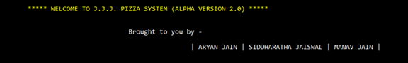
 
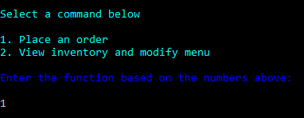
 

 
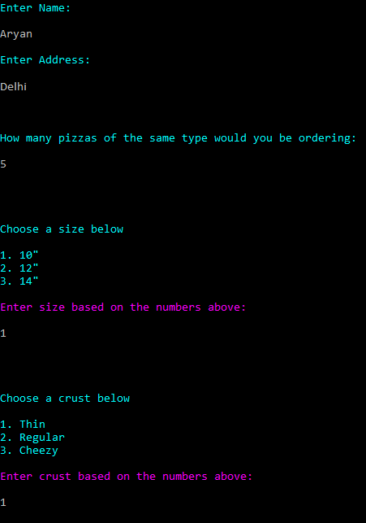
 
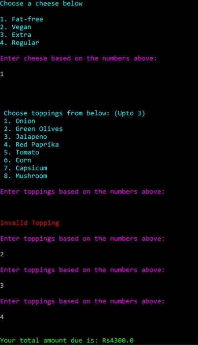
 
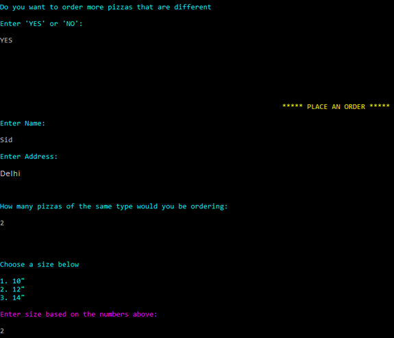
 
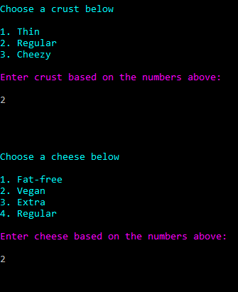
 
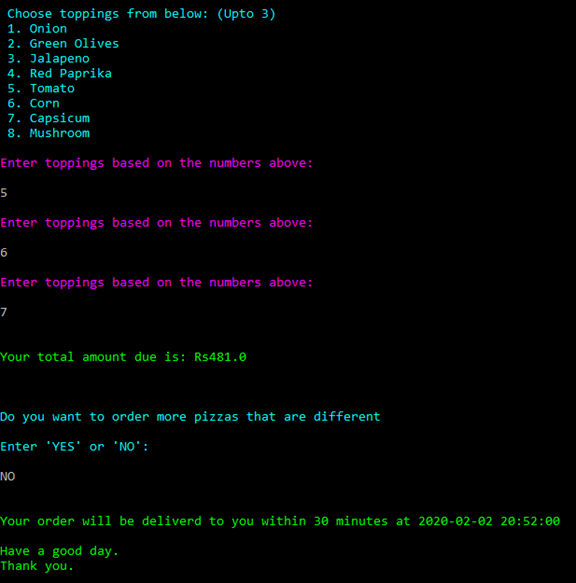
 
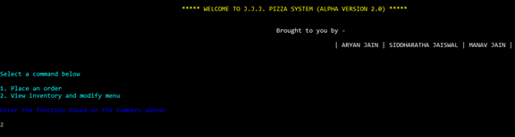
 
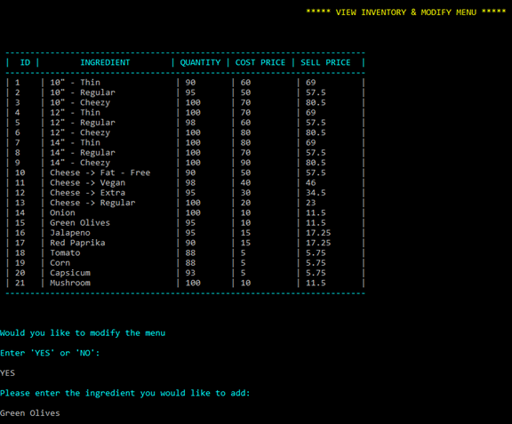
 
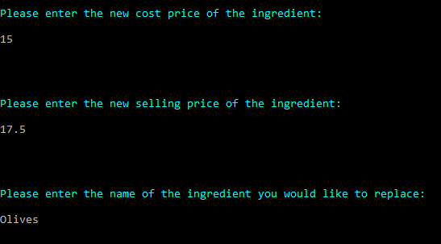
 
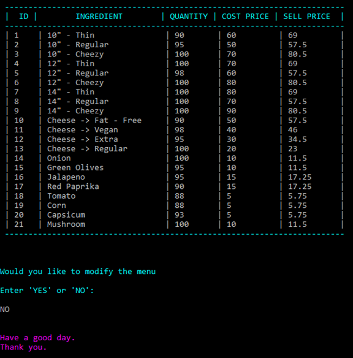

